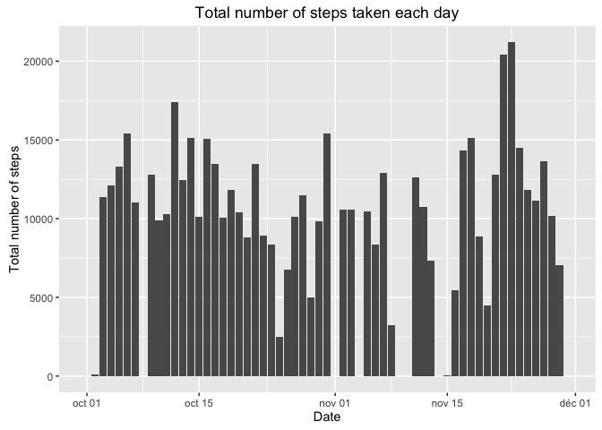
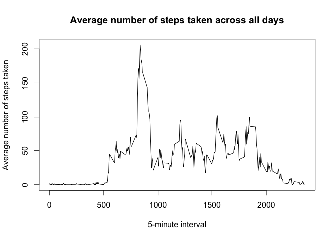
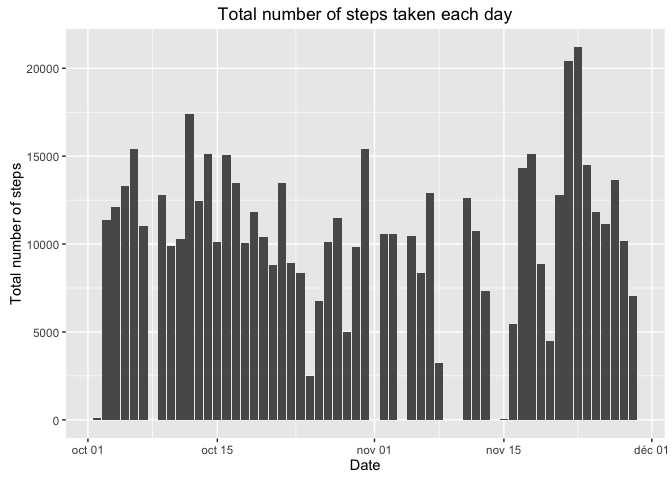
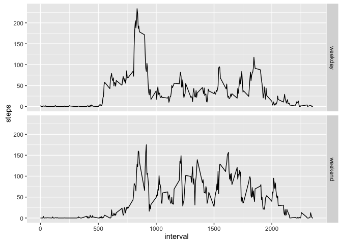

# Reproducible Research: Peer Assessment 1


## Loading and preprocessing the data

```r
library(dplyr)
```

```
## 
## Attaching package: 'dplyr'
```

```
## The following objects are masked from 'package:stats':
## 
##     filter, lag
```

```
## The following objects are masked from 'package:base':
## 
##     intersect, setdiff, setequal, union
```

```r
library(ggplot2)
library(reshape)
```

```
## 
## Attaching package: 'reshape'
```

```
## The following object is masked from 'package:dplyr':
## 
##     rename
```

```r
activity<-read.csv("activity.csv",header = TRUE,sep = ",")
activity$date <- as.Date(activity$date,"%Y-%m-%d")
```

## What is mean total number of steps taken per day?
###1. 
**Make a histogram of the total number of steps taken each day.**

```r
total <- activity %>% group_by(date) %>% summarise(sum(steps, na.rm=TRUE))
colnames(total)=c("date","steps")
ggplot(total,aes(x=total$date,y=total$steps)) + geom_bar(stat = "identity") + 
  labs(title="Total number of steps taken each day",
       x="Date", y="Total number of steps")
```

<!-- -->

###2. 
**Calculate and report the mean and median total number of steps taken per day.**

Mean total number of steps taken per day:

```r
mean(total$steps)
```

[1] 9354.23

Median total number of steps taken per day:

```r
median(total$steps)
```

[1] 10395

## What is the average daily activity pattern?

###1.

**Make a time series plot (i.e. type = "l") of the 5-minute interval (x-axis) and the average number of steps taken, averaged across all days (y-axis)**

```r
avg <- activity %>% group_by(interval) %>% summarise(mean(steps, na.rm=TRUE))
colnames(avg)=c("interval","steps")
plot(avg$interval,avg$steps,type="l", xlab="5-minute interval",
     ylab = "Average number of steps taken", 
     main="Average number of steps taken across all days")
```

<!-- -->

###2. 
**Which 5-minute interval, on average across all the days in the dataset, contains the maximum number of steps?**


```r
maxSteps <- activity %>% group_by(interval) %>% summarise(max(steps, na.rm=TRUE)) 
colnames(maxSteps) <-c("interval", "steps")
msteps <- maxSteps %>% select(-interval) %>% max()
maxSteps %>% filter(maxSteps$steps==msteps) %>% select(interval) %>% as.integer()
```

[1] 615

## Imputing missing values

###1. 
**Calculate and report the total number of missing values in the dataset (i.e. the total number of rows with NAs)**


```r
activity %>% filter(is.na(steps)==TRUE) %>% nrow()
```

[1] 2304

###2. 
**Devise a strategy for filling in all of the missing values in the dataset.The strategy does not need to be sophisticated. Use of the mean for that 5-minute interval, etc.The strategy is to create a table with all na rows and filter by date, so that we have 2304 rows worth of dates corresponding to the na rows,then bind this date data frame with the dataframe of average steps for each interval. This data frame is 288 rows and will be repeated 8 times for each date. Then bind by row the resulting dataframe to the activity data frame and filter the resulting data frame to remove the nas**

I will fill all the na values with the mean of the corresponding 5 minute interval in the dataset.

###3. 
**Create a new dataset that is equal to the original dataset but with the missing  data filled in.**


```r
avg <- arrange(avg,interval)
dates_na <- activity %>% filter(is.na(steps)==TRUE) %>% select(date) 
y <- cbind(dates_na,avg)
activity1 <- rbind(activity,y)
activity1 <- activity %>% filter(is.na(steps)==FALSE)
```

###4. 
**Make a histogram of the total number of steps taken each day and calculate and report the mean and median total number of steps taken per day.** 


```r
total1 <- activity1 %>% group_by(date) %>% summarise(sum(steps, na.rm=TRUE))
colnames(total1)=c("date","steps")
ggplot(total1,aes(x=total1$date,y=total1$steps)) + geom_bar(stat = "identity") + 
  labs(title="Total number of steps taken each day",
       x="Date", y="Total number of steps")
```

<!-- -->

**Do these values differ from the estimates from the first part of the assignment?** 

The values from the first activity table and the one with the na rows filled in differ. The mean and median are now almost equal.


```r
data <- rbind(c(mean(total$steps),mean(total1$steps)),c(median(total$steps),median(total1$steps)))
colnames(data) <- c('NA values omitted','NA values replaced')
knitr::kable(data, caption = "Means and medians comparison")
```


Table: Means and medians comparison

 NA values omitted   NA values replaced
------------------  -------------------
           9354.23             10766.19
          10395.00             10765.00

## Are there differences in activity patterns between weekdays and weekends?

###1. 
**Create a new factor variable in the dataset with two levels – “weekday” and “weekend” indicating whether a given date is a weekday or weekend day.**


```r
weekday <- weekdays(activity$date)
weekday <- factor(weekday,levels = c("Lundi","Mardi","Mercredi","Jeudi",
                                     "Vendredi","Samedi","Dimanche"),
                  labels=c("weekday","weekday","weekday","weekday",
                           "weekday","weekend","weekend"))
```

```
## Warning in `levels<-`(`*tmp*`, value = if (nl == nL) as.character(labels)
## else paste0(labels, : duplicated levels in factors are deprecated
```

```r
weekday <- combine_factor(weekday,levels(weekday))
levels(weekday)
```

[1] "weekday" "weekend"

###2. 
**Make a panel plot containing a time series plot (i.e. type = "l") of the 5-minute interval (x-axis) and the average number of steps taken, averaged across all weekday days or weekend days (y-axis). **


```r
activity <- cbind(activity,weekday)
avg1 <- activity %>% group_by(interval,weekday) %>% summarise(mean(steps, na.rm=TRUE))
colnames(avg1)=c("interval","weekday","steps")
ggplot(avg1,aes(x = interval,y=steps))+ facet_grid(weekday~.)+geom_line()
```

<!-- -->
